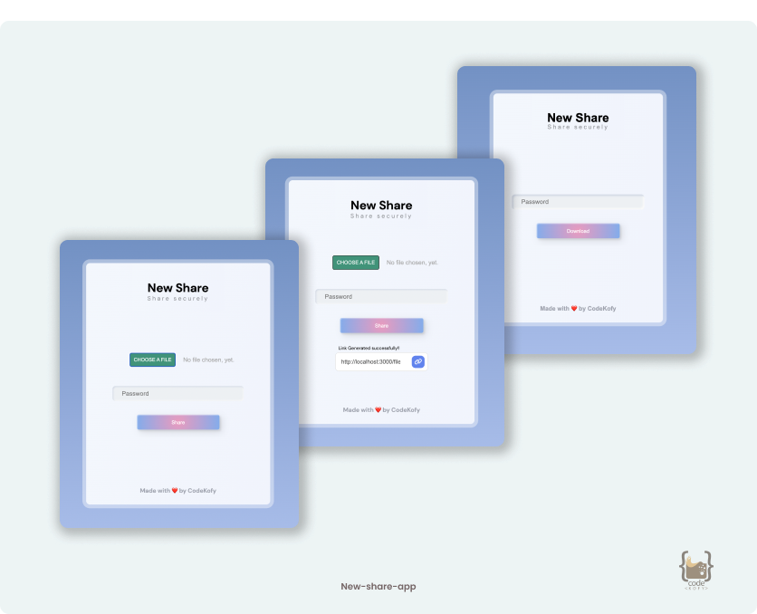

<h1 align="center">
   
  New Share App
   
</h1>

<h4 align="center">This is a simple webapp build with NodeJs and integrated with MongoDB database. The user can create link, file protected with password and can send a link to others. The user receives the Link, opened can easily download the file using the password - Safe and Secure.</h4>

  <a href="#🛠-overview">Overview</a> •
  <a href="#🚀-built-with">Build with</a> •

<h5 align="center">Don't forget to give a ⭐️ </h5>

## 🛠 Overview

- Static app
- Based on Node Js Express
- Used EJS as templating engine.
- Stunning UI

## 🚀 Built with

- [![Nodejs][Nodejs]][Nodejs-url] [![MongoDB][MongoDB]][MongoDB-url] [![ejs][ejs]][ejs-url]

[Nodejs]: https://img.shields.io/badge/Node.js-EEF2E6?style=for-the-badge&logo=node.js&logoColor=38E54D
[Nodejs-url]: https://nodejs.org/en/

[MongoDB]: https://img.shields.io/badge/MongoDB-E8F9FD?style=for-the-badge&logo=mongodb&logoColor=38E54D
[MongoDB-url]: https://www.mongodb.com/

[ejs]: https://img.shields.io/badge/ejs-FF9F29?style=for-the-badge&logo=ejs&logoColor=38E54D
[ejs-url]: https://ejs.co